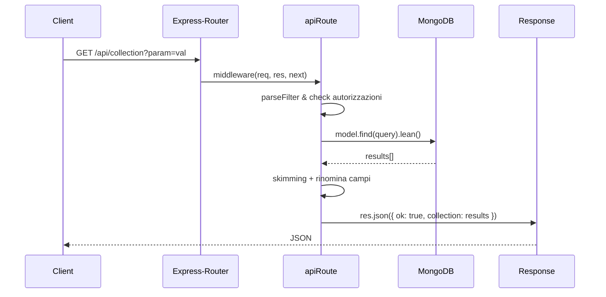

# 📦 Documentazione di `index.js`

Benvenuti nella documentazione dettagliata di **index.js**, un modulo che fornisce una factory per creare middleware Express/Mongoose con supporto a CRUD, localizzazione, paginazione, filtri e molto altro! 🚀

---

## Indice

1. [Panoramica generale](#1-panoramica-generale)  
2. [Dipendenze](#2-dipendenze)  
3. [Messaggi multilingua 🌐](#3-messaggi-multilingua-🌐)  
4. [Utilità di localizzazione](#4-utilità-di-localizzazione)  
5. [Funzione principale: `apiRoute`](#5-funzione-principale-apiroute)  
   5.1. [Parametri di ingresso](#51-parametri-di-ingresso)  
   5.2. [Validazione e normalizzazione](#52-validazione-e-normalizzazione)  
   5.3. [Costruzione del percorso (route)](#53-costruzione-del-percorso-route)  
   5.4. [Middleware generato](#54-middleware-generato)  
     - 5.4.1. [`parseFilter`](#541-parsefilter)  
     - 5.4.2. [`skimming` & `middleware` personalizzati](#542-skimming--middleware-personalizzati)  
     - 5.4.3. `res.sendMessage`  
     - 5.4.4. Controlli di metodo e percorso  
     - 5.4.5. Filtri di autorizzazione  
     - 5.4.6. Gestione di `acceptedQueryFields`  
     - 5.4.7. Paginazione (`pagesManager`)  
     - 5.4.8. [`catchMongoDBError`](#548-catchmongodberror)  
     - 5.4.9. Gestione delle operazioni CRUD  
6. [Diagramma di flusso per `GET`](#6-diagramma-di-flusso-per-get)  
7. [Esempi di utilizzo](#7-esempi-di-utilizzo)  
8. [Tipi di risposta & gestione errori](#8-tipi-di-risposta--gestione-errori)  
9. [Export del modulo](#9-export-del-modulo)  

---

## 1. Panoramica generale

Questo file esporta:

- Una costante `BrowserLanguage` (Symbol)  
- Una funzione `defineMessage` per aggiungere/override di messaggi multilingua  
- La funzione di default `apiRoute(model, options)` che genera un middleware Express per esporre un’API RESTful completa (CRUD) su un modello Mongoose, con:  
  - Filtri di autorizzazione  
  - Gestione dei metodi HTTP consentiti  
  - Localizzazione dei messaggi di errore  
  - Paginazione  
  - Mapping e rinomina dinamica di campi  
  - Hook personalizzati (_skimming_ e _middleware_)  

---

## 2. Dipendenze

| Modulo       | Scopo                                              |
|--------------|----------------------------------------------------|
| `mongoose`   | Modellazione e query su MongoDB                    |
| `express`    | Creazione di middleware HTTP                       |
| `body-parser`| Parsing del corpo delle request (JSON)             |
| `colors`     | Colorazione dei log in console                     |

```js
import mongoose       from 'mongoose';
import express        from 'express';
import bodyParser     from 'body-parser';
import 'colors';
```

---

## 3. Messaggi multilingua 🌐

L’oggetto `messages` definisce traduzioni per codici di errore numerici (1…11). È possibile aggiungere o sovrascrivere messaggi tramite `defineMessage`.

Estratto per i primi codici:

```js
const messages = {
  __userMessages: {},
  1: {
    it: 'La richiesta non è valida.',
    en: 'The request is invalid.',
    es: 'La solicitud no es válida.',
    // … altre lingue …
  },
  2: {
    it: 'Non puoi filtrare i risultati con il parametro «{key}».',
    en: 'You cannot filter results by the “{key}” parameter.',
    // … altre lingue …
  },
  // … fino al codice 11 …
};
```

---

## 4. Utilità di localizzazione

🔧 **BrowserLanguage**  
Un `Symbol('BrowserLanguage')` usato per distinguere tra lingua forzata e lingua determinata dalle preferenze del client.

✨ **defineMessage(number, value)**  
Aggiunge o sovrascrive un messaggio utente:
- `number` (Number): codice del messaggio  
- `value` (Object): mappa `lang → string`

🔍 **message(number, lang, replace = {})**  
Restituisce il messaggio localizzato, applicando i placeholder:
- Fallback a inglese se la lingua non esiste
- Sostituisce `{key}` con `replace[key]`

```js
// Esempio
defineMessage(12, { it: 'Utente non trovato.', en: 'User not found.' });
message(12, 'it'); // → 'Utente non trovato.'
```

---

## 5. Funzione principale: `apiRoute(model, options)`

```js
function apiRoute(model, options = {}) { /* ... */ }
export default apiRoute;
```

Genera un middleware asincrono per Express, che espone un endpoint CRUD sul `model` Mongoose.

### 5.1 Parametri di ingresso

| Parametro  | Tipo                        | Default                                             | Descrizione |
|------------|-----------------------------|-----------------------------------------------------|-------------|
| `model`    | `mongoose.Model`            | **REQUIRED**                                        | Modello su cui operare |
| `options`  | `Object`                    | `{}`                                                | Configurazione (vedi sotto) |

**Chiavi di `options`:**

| Chiave                    | Tipo                      | Default                     | Descrizione                                                                 |
|---------------------------|---------------------------|-----------------------------|-----------------------------------------------------------------------------|
| `filter`                  | Function \| Function[]    | `[]`                        | Funzioni di autorizzazione personalizzate                                    |
| `methods`                 | String[]                  | `['PUT','POST','GET','DELETE']` | Metodi HTTP consentiti                                                       |
| `route`                   | String                    | `'/api/{collectionName}'`   | URL dell’endpoint (supporta `{modelName}` e `{collectionName}`)              |
| `fields`                  | Object                    | `null`                      | Mappatura campi per lingua e visibilità                                      |
| `pagesManager`            | Object                    | `null`                      | `{ limit: '?limit', page: '?page', maxResults: Number }` per paginazione      |
| `acceptedQueryFields`     | String[] \| Object        | Tutti i campi dello schema   | Campi ammessi per query su ciascun metodo                                   |
| `throwRefusedQueryFields` | Boolean                   | `true`                     | Se `true`, rifiuta richieste con campi query non consentiti (400)            |
| `language`                | String \| Symbol           | Lingua browser              | Forza una lingua specifica                                                    |
| `options` _(nested)_      | Object                     | `{}`                        | Configurazioni per metodo: `skimming`, `middleware`, `fields`                |

---

### 5.2 Validazione e normalizzazione

- **`filter`**: deve essere funzione o array di funzioni, altrimenti lancia un `Error`.
- **`methods`**: array di stringhe, valide solo quelle in `allowedMethods`.
- **`route`**: se specificato, deve essere stringa e supportare i placeholder `{modelName}`, `{collectionName}`.

---

### 5.3 Costruzione del percorso (route)

```js
if(route) {
  route = route
    .replaceAll('{modelName}', model.modelName)
    .replaceAll('{collectionName}', model.collection.name);
} else {
  route = '/api/' + model.collection.name;
}
```

---

### 5.4 Middleware generato

Il middleware restituito gestisce tutte le fasi di una chiamata API:

#### 5.4.1 parseFilter

```js
const parseFilter = (object, fields) => {
  // - Traduzione nomi campi (fields)
  // - Rimozione campi non ammessi
  // - Paginazione (pagesManager)
  // - Errore 400 se throwRefusedQueryFields
};
```

- **Input**: `object` (req.query o req.body), `fields` (mappatura custom)
- **Output**: oggetto filtro compatibile con Mongoose
- Gestisce:
  - Rinomina campi custom per lingua
  - Controllo `acceptedQueryFields`
  - Parametri `limit` e `page` se `pagesManager` attivo

#### 5.4.2 skimming & middleware personalizzati

- **Skimming**: filtra i risultati dopo la query  
- **Middleware**: hook asincrono che riceve `{ document, req, res, next, query }` e può modificarli

#### 5.4.3 res.sendMessage

Aggiunge al `res` un metodo:

```js
res.sendMessage = (number, replace) => {
  const ok = res.statusCode >= 200 && res.statusCode < 300;
  res.json({
    ok,
    status: res.statusCode,
    [ ok ? 'message' : 'error' ]: message(number, lang, replace)
  });
};
```

Usato per risposte rapide con solo `ok`, `status` e messaggio tradotto.

#### 5.4.4 Controlli di metodo e percorso

- Se `req.method` non è in `methods`, passa il controllo con `next()`
- Se `req.path` non coincide con `route`, passa con `next()`

#### 5.4.5 Filtri di autorizzazione

Per ogni funzione in `filter`, viene invocata con `{ req, res, next, query }`:

- Se restituisce `true`: approvato  
- `false`: **403 Forbidden** con messaggio 11  
- Oggetto: risposta custom con `status` e JSON  

#### 5.4.6 Gestione di `acceptedQueryFields`

Trasforma `acceptedQueryFields` in mappa per ogni metodo, quindi controlla `req.query` (GET) o `req.body` (POST/PUT/DELETE).

#### 5.4.7 Paginazione (`pagesManager`)

Se attivo, interpreta parametri `?limit` e `?page`, applica:
- `skip((page-1)*limit).limit(limit)`
- Massimo `maxResults`

#### 5.4.8 catchMongoDBError

```js
if(error.name === 'ValidationError') {
  // Mappa gli errori Mongoose in array di
  // { target: field, error: string }
  // con messaggi tradotti (codici 3–10)
}
```

In caso di validazione, restituisce **400 Bad Request** con lista di errori dettagliati.

#### 5.4.9 Gestione delle operazioni CRUD

| Metodo | Azione                                                                                                                                             |
|--------|----------------------------------------------------------------------------------------------------------------------------------------------------|
| GET    | - `model.find(query)` (con lean, sort e paginazione)  <br>- Skimming  <br>- Rinomina/nasconde campi  <br>- Risponde `{ ok: true, [collection]: Array }` |
| POST   | - Nuovo documento `new model(query)`  <br>- Middleware  <br>- `save()` + `catchMongoDBError`  <br>- Skimming + rinomina  <br>- `{ ok: true, document }` |
| PUT    | - `findOneAndUpdate(query, set)`  <br>- Recupera documento aggiornato  <br>- Skimming + rinomina  <br>- `{ ok: true, [modelName]: document }`         |
| DELETE | - `find()` + (skimming → deleteOne per risultato) **o** `deleteMany(query)`  <br>- `{ ok: true }`                                                    |

---

## 6. Diagramma di flusso per `GET`



---

## 7. Esempi di utilizzo

```js
import express   from 'express';
import apiRoute  from './index.js';
import User      from './models/User.js';

const app = express();
app.use(express.json());

app.use(
  apiRoute(User, {
    methods: ['GET','POST','PUT','DELETE'],
    route: '/api/users',
    acceptedQueryFields: ['name','email','age'],
    throwRefusedQueryFields: true,
    pagesManager: { limit: '?limit', page: '?page', maxResults: 100 },
    fields: {
      name:  { it: 'nome', en: 'name' },
      email: { it: 'email', en: 'email' }
    },
    filter: [
      async ({ req }) => {
        // Esempio di autorizzazione
        return req.user?.isAdmin === true;
      }
    ]
  })
);

app.listen(3000, () => console.log('Server avviato 🚀'));
```

---

## 8. Tipi di risposta & gestione errori

| Codice HTTP | Body                                                               |
|-------------|--------------------------------------------------------------------|
| 200/201     | `{ ok: true, ... }` (array o documento)                           |
| 400         | `{ ok: false, status: 400, errors: [ { target, error } ] }`<br>oppure `<  errors  >` per campi non ammessi              |
| 403         | `{ ok: false, status: 403, error: string }`                        |
| Altro       | Passa al `next()` per gestioni esterne (es. 404, 405, ecc.)        |

---

## 9. Export del modulo

```js
export { BrowserLanguage, defineMessage };
export default apiRoute;
```

- **BrowserLanguage**: `Symbol` per controllo lingua  
- **defineMessage**: aggiungi/sovrascrivi messaggi  
- **apiRoute** _(default)_: factory per il middleware CRUD  

---

🎉 _Fine della documentazione di **mongodb-api-router**!_ Espero che questa guida vi aiuti a integrare in modo semplice e flessibile le vostre API Express/Mongoose. Buon coding! 👩‍💻👨‍💻