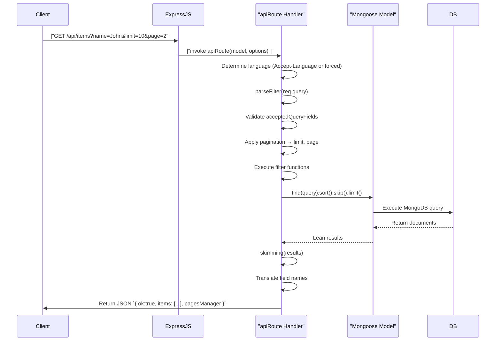

# 📄 `mongodb-api-router` Documentation

Welcome to the comprehensive documentation for `mongodb-api-router`, a powerful factory for creating multilingual, filterable, paginated CRUD API routes in an Express.js + Mongoose application.  

---

## 📋 Table of Contents

1. [Overview](#1-overview)  
2. [Exports](#2-exports)  
3. [Localization Messages](#3-localization-messages)  
4. [BrowserLanguage Symbol](#4-browserlanguage-symbol)  
5. [Utility Functions](#5-utility-functions)  
   - [5.1. `defineMessage(number, value)`](#51-definemessage)  
   - [5.2. `message(number, lang, replace)`](#52-message)  
6. [The `apiRoute()` Factory](#6-apiroute-factory)  
   - [6.1. Purpose & Usage](#61-purpose--usage)  
   - [6.2. Options](#62-options)  
   - [6.3. Handler Flow](#63-handler-flow)  
   - [6.4. CRUD Operations](#64-crud-operations)  
   - [6.5. Error Handling](#65-error-handling)  
7. [Sequence Diagram: GET Request Flow](#7-sequence-diagram-get-request-flow)  
8. [Usage Example](#8-usage-example)  
9. [Exceptions & Errors](#9-exceptions--errors)  

---

## 1. Overview

`mongodb-api-router` exports:

- A **multilingual message system** (`messages`, `defineMessage`, `message`).
- A **`BrowserLanguage`** Symbol for locale control.
- A **default** export: `apiRoute(model, options)` — a factory that generates Express middleware for RESTful endpoints on a given Mongoose model.

Features:

- Automatic **GET**, **POST**, **PUT**, **DELETE** handling.
- **Filtering**, **pagination**, **field renaming** and **skimming** (post‐query filtering).
- **Custom middleware** hooks per HTTP method.
- **Error translation** into multiple languages.

---

## 2. Exports

| Export             | Type         | Description                                                  |
|--------------------|--------------|--------------------------------------------------------------|
| `BrowserLanguage`  | Symbol       | Force-use a specific language instead of the browser’s.      |
| `defineMessage`    | Function     | Add or override localized messages by code number.           |
| `message`          | Function     | Retrieve a translated message (with placeholders).           |
| `apiRoute` (default) | Function   | Factory to create an Express.js route handler for a Mongoose model. |

---

## 3. Localization Messages

A set of default messages keyed by numeric codes (1–11), each with translations:

| Code | English Default                                        |
|------|--------------------------------------------------------|
| 1    | The request is invalid.                                |
| 2    | You cannot filter results by the “{key}” parameter.    |
| 3    | The field “{target}” is required.                      |
| 4    | The field “{target}” is too short.                     |
| 5    | The field “{target}” is too long.                      |
| 6    | The value of “{target}” is too low.                    |
| 7    | The value of “{target}” is too high.                   |
| 8    | The value of “{target}” is not valid.                  |
| 9    | The format of “{target}” is incorrect.                 |
| 10   | The value of “{target}” is not of the expected type.   |
| 11   | You cannot make this request.                          |

```js
// messages structure (excerpt)
const messages = {
  __userMessages: {},
  1: { en: 'The request is invalid.', it: 'La richiesta non è valida.', /*...*/ },
  2: { en: 'You cannot filter results by the “{key}” parameter.', /*...*/ },
  // ...
  11: { en: 'You cannot make this request.', /*...*/ }
}
```

---

## 4. BrowserLanguage Symbol

```js
const BrowserLanguage = Symbol('BrowserLanguage');
```

Use this **symbol** in the `options.language` field of `apiRoute()` to **force** all responses to a given locale, **ignoring** the client’s `Accept-Language` header.

---

## 5. Utility Functions

### 5.1. `defineMessage(number, value)`

Register or override a set of translations for **message code** `number`.

- **Parameters**  
  • `number` (Number): The message code to define.  
  • `value` (Object): `{ [langCode]: 'Translated text', ... }`.

- **Returns**  
  • `undefined` (modifies internal `messages.__userMessages`).

```js
defineMessage(12, {
  en: 'Custom error occurred.',
  es: 'Ocurrió un error personalizado.'
});
```

---

### 5.2. `message(number, lang, replace)`

Retrieve a translated message by **code**, with optional **placeholder replacement**.

- **Parameters**  
  • `number` (Number): Message code.  
  • `lang` (String): Language code (`'en'`, `'it'`, etc.).  
  • `replace` (Object): `{ key: 'value', target: 'fieldName' }`.

- **Returns**  
  • `String`: The localized, interpolated message.

```js
message(3, 'fr', { target: 'nom' });
// → 'Le champ « nom » est requis.'
```

---

## 6. apiRoute() Factory

### 6.1. Purpose & Usage

Generate an Express middleware that provides **CRUD endpoints** on a Mongoose **model** with:

- Query filtering & validation  
- Pagination  
- Field translation & omission  
- Per-method middleware hooks  
- Multilingual error messages  

```js
import express from 'express';
import mongoose from 'mongoose';
import apiRoute from './index.js';

const User = mongoose.model('User', new mongoose.Schema({
  name: String,
  age: Number
}));

const app = express();
app.use(express.json());

// Mount /api/users
app.use(
  apiRoute(User, {
    methods: ['GET','POST','PUT','DELETE'],
    pagesManager: { maxResults: 100 },
    acceptedQueryFields: ['name','age'],
    fields: { name: { en: 'name', it: 'nome' } },
    options: {
      POST: {
        middleware: async ({ document }) => {
          document.createdAt = Date.now();
        }
      }
    }
  })
);

app.listen(3000);
```

---

### 6.2. Options

| Option                     | Type                       | Default             | Description |
|----------------------------|----------------------------|---------------------|-------------|
| **model** (first arg)      | Mongoose Model             | —                   | The target model for CRUD. |
| **filter**                 | Function \| Function[]     | `[]`                | Pre-handler checks. Return `true` to continue; `false` or object for error. |
| **methods**                | String[]                   | `['GET','POST','PUT','DELETE']` | Allowed HTTP methods. |
| **route**                  | String                     | `'/api/{collectionName}'` | Base path (`{modelName}`, `{collectionName}` placeholders supported). |
| **fields**                 | Object                     | `null`              | Map model fields to custom names per locale. |
| **pagesManager**           | Object                     | `undefined`         | `{ limit: '?limit', page: '?page', maxResults }` for pagination. |
| **acceptedQueryFields**    | String[] \| Object         | `model.schema.paths`| Fields allowed in `req.query` / `req.body`. |
| **throwRefusedQueryFields**| Boolean                    | `true`              | 400 on unallowed query fields. |
| **language**               | String \| Symbol           | `req.acceptsLanguages()[0]` | Force locale if not `BrowserLanguage`. |
| **options**                | Object                     | `{}`                | Method-specific:  
|                            |                            |                     | • `options.GET`, `options.POST`, etc. |

#### 6.2.1. `options[method]` sub‐options

| Sub‐Option    | Type                    | Description |
|---------------|-------------------------|-------------|
| **middleware**| `Function \| Function[]`| Runs before saving/updating. Receives `{ document, req, res, next, query }`. |
| **skimming**  | `Function \| Function[]`| Post‐query filter: return `true` to keep each document. |

---

### 6.3. Handler Flow

1. **Initialize** options: normalize `filter`, `methods`, `route`.  
2. **Incoming request** → determine **language** (override if `options.language !== BrowserLanguage`).  
3. **Merge** method‐specific `options[method]`.  
4. **Parse & validate** query/body via `parseFilter()`:  
   - Rename fields  
   - Enforce `acceptedQueryFields`  
   - Apply pagination parameters  
5. **Run** each `filter` function → may short‐circuit with **403**/**custom error**.  
6. **Dispatch** by HTTP method:  
   - **GET** → `Model.find()`, optional **skimming**, field translation, JSON result + paging.  
   - **POST** → new document, `middleware`, `.save()`, skimming, field translation.  
   - **PUT** → `.findOneAndUpdate()`, `middleware({ query, set })`, re‐fetch, skimming, translation.  
   - **DELETE** → find matching docs, optional skimming, `.deleteOne()`/`.deleteMany()`.  

---

### 6.4. CRUD Operations

| Method | Action                                                                                                          | Response Body                                                  |
|--------|-----------------------------------------------------------------------------------------------------------------|----------------------------------------------------------------|
| GET    | `.find(query).sort().skip().limit().lean()` → `skimming()` → translate → `{ ok: true, [collection]: [...] }` | Results array + optional `pagesManager` info                  |
| POST   | `new model(query).save()` → `skimming()` → translate → `{ ok: true, document }`                                | Newly created document                                        |
| PUT    | `findOneAndUpdate(query, set)` → re‐fetch → `skimming()` → translate → `{ ok: true, modelName: document }`     | Updated document                                              |
| DELETE | `.find(query).lean()` → `skimming()` → deletion → `{ ok: true }`                                                | Confirmation                                                   |

---

### 6.5. Error Handling

- **Invalid options** → thrown synchronously (e.g. non‐array `methods`, invalid `route` type).  
- **Filter rejection** → `403` or custom payload.  
- **MongoDB ValidationError** → aggregated into `400` with per‐field errors using localized messages (codes 3–10).  
- **Unallowed query fields** → `400` with error code 2.

---

## 7. Sequence Diagram: GET Request Flow



---

## 8. Usage Example

```js
import express from 'express';
import mongoose from 'mongoose';
import apiRoute, { defineMessage, BrowserLanguage } from './index.js';

// 1. Define schema & model
const productSchema = new mongoose.Schema({
  title: String,
  price: Number,
  category: String
});
const Product = mongoose.model('Product', productSchema);

// 2. Override a default message
defineMessage(2, { en: 'Filtering by “{key}” is not permitted.' });

// 3. Create Express app
const app = express();
app.use(express.json());

// 4. Mount API route
app.use(
  apiRoute(Product, {
    methods: ['GET','POST','DELETE'],
    fields: {
      title: { en: 'title', es: 'titulo' },
      price: { en: 'price', es: 'precio' }
    },
    acceptedQueryFields: ['title','price'],
    pagesManager: { limit: '?limit', page: '?page', maxResults: 50 },
    options: {
      POST: {
        middleware: async ({ document }) => {
          // Auto‐stamp creation date
          document.createdAt = new Date();
        }
      }
    },
    language: BrowserLanguage // always use Accept-Language
  })
);

// 5. Start server
app.listen(3000, () => console.log('API listening on 3000'));
```

---

## 9. Exceptions & Errors

| Condition                                             | Exception Message                                                                         |
|-------------------------------------------------------|-------------------------------------------------------------------------------------------|
| `filter` not function or array of functions           | `apiRoute(model, { filter }) -> filter must be a function, or an array of functions`    |
| `methods` not an array                                | `apiRoute(model, { methods }) -> methods must be an array of methods`                    |
| Invalid HTTP method in `methods`                      | `apiRoute(model, { methods }) -> invalid method "<METHOD>"`                              |
| `route` not a string                                  | `apiRoute(model, { route }) -> invalid route, it must be a string`                       |
| Unallowed query field (by default)                    | 400 JSON `{ ok:false, status:400, error: message(2) }`                                     |
| MongoDB `ValidationError`                              | 400 JSON with `errors: [ { target, error } ]` using codes 3–10                             |

---

*Enjoy building multilingual, flexible REST APIs with zero boilerplate!* 🚀