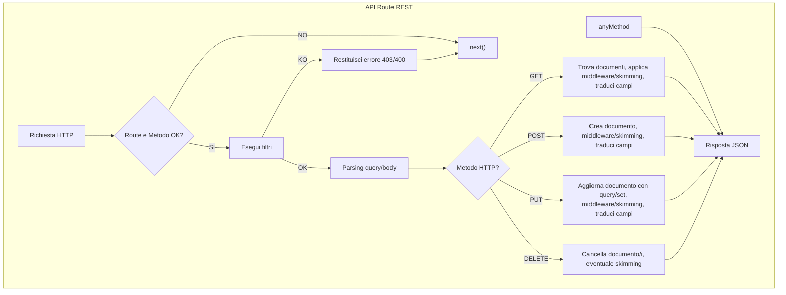
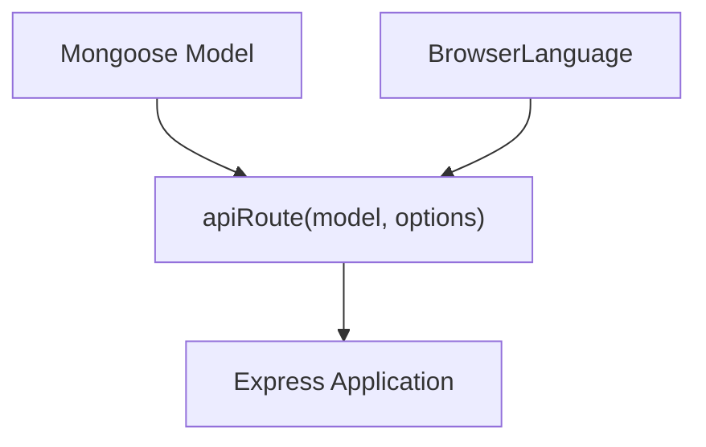
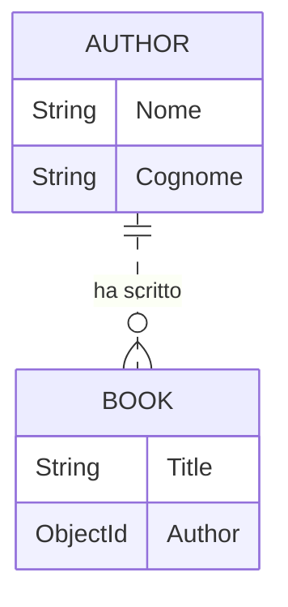

# 📚 Documentazione Estesa del Progetto API Express/Mongoose Multilingua

## Indice

1. [Panoramica Generale](#panoramica-generale)
2. [Architettura dei File](#architettura-dei-file)
3. [index.js — Middleware API Express/Mongoose Multilingua](#indexjs)
    - [Funzionalità](#funzionalità)
    - [Gestione Messaggi Multilingua](#gestione-messaggi-multilingua)
    - [Signature e Parametri](#signature-e-parametri)
    - [Dettaglio Opzioni: "fields"](#dettaglio-opzioni-fields)
    - [Flusso Principale](#flusso-principale)
    - [Eccezioni e Gestione Errori](#eccezioni-e-gestione-errori)
    - [Diagramma dei Componenti Principali](#diagramma-dei-componenti-principali)
4. [example.js — Esempio Avanzato](#examplejs)
    - [Schema e Relazioni](#schema-e-relazioni)
    - [Configurazione Avanzata del Middleware](#configurazione-avanzata-del-middleware)
    - [Struttura Dettagliata di "fields" nell'Esempio](#struttura-dettagliata-di-fields-nellesempio)
    - [Esempi di Middleware e Skimming](#esempi-di-middleware-e-skimming)
    - [EndPoint API](#endpoint-api)
    - [Diagramma delle Relazioni tra Modelli](#diagramma-delle-relazioni-tra-modelli)
5. [example-simple.js — Esempio Semplificato](#example-simplejs)
    - [Funzionalità Principali](#funzionalità-principali)
    - [Esempio di Configurazione Minima](#esempio-di-configurazione-minima)
6. [Conclusioni](#conclusioni)

---

## Panoramica Generale

Questa libreria fornisce un **middleware Express** per la generazione automatica di rotte RESTful su modelli Mongoose, includendo:
- Gestione multilingua dei messaggi di errore (🇮🇹 🇬🇧 🇪🇸 🇫🇷 🇩🇪 ecc.)
- Validazione dinamica dei parametri di query e body
- Middleware personalizzabili per ogni metodo HTTP (GET, POST, PUT, DELETE)
- Gestione della paginazione
- Traduzione dinamica dei campi degli schemi
- Possibilità di “skimming” e manipolazione dati prima della risposta

---

## Architettura dei File

| File                  | Ruolo                                                                 |
|-----------------------|-----------------------------------------------------------------------|
| `index.js`            | Middleware principale, gestione logica API, errori e traduzioni       |
| `example.js`          | Esempio d’uso avanzato: modelli relazionati, middleware, skimming     |
| `example-simple.js`   | Esempio d’uso minimale: API CRUD rapida su due modelli                |

---

## index.js

### Funzionalità

- **Espone** una funzione `apiRoute(model, options)` che genera un middleware Express per CRUD RESTful su un modello Mongoose.
- **Gestione automatica degli errori** e messaggi in più lingue.
- **Paginazione**, filtro, validazione parametri query/body, personalizzazione campi restituiti.
- **Estensione tramite opzioni**: middleware, skimming, fields, acceptedQueryFields, ecc.
- **Costruzione dinamica della rotta** con possibilità di personalizzare tramite `{modelName}` e `{collectionName}`.

### Gestione Messaggi Multilingua

Una mappa `messages` contiene errori comuni in molte lingue. La funzione `message(numero, req, replace)` gestisce il recupero e la sostituzione dinamica dei placeholder.

#### Esempio

```js
message(3, req, { target: "Nome" });
// "Il campo «Nome» è obbligatorio." (in base alla lingua del browser)
```

> ⚠️ **Nota**: La lingua viene inferita da `req.acceptsLanguages()`.

### Signature e Parametri

```js
function apiRoute(model, options = {}) => (req, res, next) => { ... }
```

| Parametro          | Tipo            | Descrizione                                              |
|--------------------|-----------------|----------------------------------------------------------|
| `model`            | Mongoose Model  | Il modello su cui esporre le rotte                       |
| `options`          | Oggetto         | Configurazione avanzata (vedi tabella sotto)             |

#### Opzioni Avanzate

| Opzione                  | Tipo                          | Descrizione                                                                 |
|--------------------------|-------------------------------|-----------------------------------------------------------------------------|
| `filter`                 | Function/Array                | Funzione/i di filtro per autorizzazione/validazione                         |
| `methods`                | Array                         | Metodi HTTP permessi (default: tutti)                                       |
| [`fields`](#dettaglio-opzioni-fields) | Oggetto        | Traduzioni/visibilità dei campi restituiti                                  |
| `route`                  | String                        | Percorso personalizzato (usa `{modelName}`, `{collectionName}`)             |
| `pagesManager`           | Oggetto                       | Configurazione paginazione (`limit`, `page`, `maxResults`)                  |
| `acceptedQueryFields`    | Oggetto/Array                 | Campi accettati in query per metodo                                         |
| `throwRefusedQueryFields`| Boolean                       | Restituisce errore se parametri non permessi (default: false)               |
| `language`               | String/Symbol                 | Forza lingua (o usa BrowserLanguage per autodetect)                         |
| `options`                | Oggetto per metodo            | Middleware/skimming/fields personalizzati per metodo                        |

---

### Dettaglio Opzioni: "fields"

L’opzione `fields` permette di:
- **Tradurre i nomi dei campi** nei risultati in base alla lingua richiesta
- **Nascondere campi** dalla risposta JSON
- **Aggiungere logica avanzata** (es: mostrare solo in certe condizioni, se implementato)

#### Struttura di `fields`

```js
fields: {
  <NomeCampo>: {
    <codiceLingua>: <NomeTradotto>,
    show: <boolean> // opzionale, default true
  },
  ...
}
```

**Esempi pratici:**

```js
fields: {
  Title: { it: "Titolo", en: "Title" },    // "Title" viene chiamato "Titolo" per lingua italiana
  __v: { show: false },                    // Il campo "__v" non viene mai restituito
  Nome: { it: "Nome", en: "Name", show: true }
}
```

#### Spiegazione delle proprietà

| Proprietà           | Tipo      | Descrizione                                                         |
|---------------------|-----------|---------------------------------------------------------------------|
| `<codiceLingua>`    | String    | Codice lingua (es: `it`, `en`, `fr`, ecc.), imposta alias del campo |
| `show`              | Boolean   | Se `false`, il campo viene rimosso dalla risposta JSON              |

##### Esempio Risposta API con `fields` configurato

Supponendo:

```
fields: {
  Title: { it: "Titolo" },
  __v: { show: false }
}
```

**Risposta per lingua italiana**
```json
{
  "books": [
    {
      "Titolo": "Il nome della rosa",
      "Author": "..."
    }
  ]
}
```

**Risposta per lingua inglese (o default)**
```json
{
  "books": [
    {
      "Title": "Il nome della rosa",
      "Author": "..."
    }
  ]
}
```

**Nota:** Se un campo è impostato con `show: false`, non apparirà nella risposta.

---

### Flusso Principale

Il middleware, una volta montato, gestisce automaticamente tutte le richieste CRUD verso la rotta specificata:



---

### Eccezioni e Gestione Errori

**Eccezioni principali sollevate:**
- `filter` non è funzione o array di funzioni 👉 `Error`
- `methods` non è array o contiene valori non consentiti 👉 `Error`
- `route` non è stringa 👉 `Error`
- Errori Mongoose (validation, cast, enum, ecc.) 👉 Risposta 400 dettagliata e tradotta

**Restituisce sempre** risposta JSON in caso di errore, con struttura:
```json
{ "ok": false, "status": 400, "error": "Messaggio tradotto", ... }
```

---

### Diagramma dei Componenti Principali



---

## example.js

### Schema e Relazioni

Due modelli collegati: **Author** e **Book**. Book ha una reference a Author.



#### Codice

```js
const authorSchema = new mongoose.Schema({ Nome: { type: String, minlength: 10 }, Cognome: String });
const Author = mongoose.model('Author', authorSchema);

const bookSchema = new mongoose.Schema({ Title: { type: String, required: true }, Author: { type: mongoose.Types.ObjectId, ref: 'Author' } });
const Book = mongoose.model('Book', bookSchema);
```

---

### Configurazione Avanzata del Middleware

Qui viene mostrato un uso **ricco** di tutte le opzioni del middleware:

- **Gestione lingua**: auto da browser (`BrowserLanguage`)
- **Filtri**: array di funzioni (qui sempre `true`)
- **Metodi**: abilitati tutti i CRUD
- **Traduzione campi**: `Title` → `"Titolo"` in italiano
- **Esclusione campi**: `__v: { show: false }`
- **Rotta personalizzata**: `/db/{collectionName}`
- **Paginazione**: personalizzabile da query, max 100 risultati
- **Campi query accettati**: solo `Title` per GET
- **Middleware/skimming per ogni metodo**:
    - GET: modifica dati in risposta
    - POST: trasforma titolo in maiuscolo, elimina `_id` in risposta
    - PUT: risposta custom JSON

---

### Struttura Dettagliata di "fields" nell'Esempio

Nell’esempio avanzato, la proprietà `fields` è così strutturata:

```js
fields: {
  Title: { it: 'Titolo' },    // Solo per la lingua italiana, il campo "Title" diventa "Titolo"
  __v: { show: false }        // Il campo "__v" viene nascosto in tutte le risposte
}
```

**Significato:**
- `"Title: { it: 'Titolo' }"`:  
  Quando la lingua accettata è italiana, il campo `"Title"` verrà restituito come `"Titolo"`. In tutte le altre lingue, il campo rimane `"Title"` (salvo altre traduzioni specificate).
- `"__v: { show: false }"`:  
  Il campo di versione interna di Mongoose non verrà mai restituito nella risposta API.

Puoi aggiungere altre lingue o configurazioni così:

```js
fields: {
  Title: { it: 'Titolo', en: 'Title', fr: 'Titre' },
  __v: { show: false },
  Author: { it: 'Autore', show: true }
}
```
In questo modo il campo `"Title"` sarà adattato secondo la lingua della richiesta.

---

### Esempi di Middleware e Skimming

```js
options: {
  get: {
    middleware: ({ query }) => { /* manipola query prima della ricerca */ },
    skimming: [ 
      ({ req, res, next, document }) => {
        document.Title = "Titolo: " + document.Title; return true;
      },
      ({ req, res, next, document }) => {
        return document.Title.length > 1;
      }
    ]
  },
  post: {
    middleware: [ async ({ req, res, next, document }) => {
      document.Title = document.Title.toUpperCase();
    }],
    skimming: ({ document }) => { delete document._id; return true; },
    fields: { __v: { show: true } }
  },
  put: {
    middleware: ({ res, document }) => { res.json({ ok: false }) }
  }
}
```

---

### EndPoint API

- **GET /db/books** — Ricerca libri, con paginazione e filtro permessi
- **POST /db/books** — Crea libro, trasforma titolo
- **PUT /db/books** — Aggiorna libro, middleware personalizzato
- **DELETE /db/books** — Cancella secondo filtro

---

### Diagramma delle Relazioni tra Modelli

Vedi sopra: [Schema e Relazioni](#schema-e-relazioni)

---

## example-simple.js

### Funzionalità Principali

- Esempio **minimale** di uso del middleware:
    - Rotte CRUD complete su Book e Author
    - Si dimostra come montare più istanze, ognuna su un modello diverso

### Esempio di Configurazione Minima

```js
app.use(apiRoute(Book, { filter: ({ req, res }) => false })); // blocca tutto su Book
app.use(apiRoute(Author)); // CRUD completo e automatico su Author
```

---

## Conclusioni

Questa libreria offre una soluzione potente e flessibile per la creazione di API RESTful multilingua su modelli Mongoose, con un focus su:
- **Esperienza utente internazionale** (messaggi tradotti)
- **Sicurezza e validazione** tramite filtri e controllo campi
- **Facilità di estensione** per middleware, skimming, campi personalizzati
- **Adattabilità**: dalla configurazione minima a quella enterprise

### Esempio di risposta errore validato

```json
{
  "ok": false,
  "status": 400,
  "errors": [
    {
      "target": "Nome",
      "errorMessage": "Il campo «Nome» è obbligatorio."
    }
  ]
}
```

---

## FAQ

- **Cosa succede se il browser invia una lingua non prevista?**  
  → Viene usata la lingua inglese di default.

- **Posso gestire più modelli contemporaneamente?**  
  → Sì, monta più volte il middleware con modelli diversi.

- **Posso modificare i dati in risposta?**  
  → Usa i middleware/skimming nelle opzioni avanzate.

---

## 📝 Note Finali

- Tutte le configurazioni avanzate sono **opzionali**.
- Il middleware è idempotente: non risponde se la rotta/metodo non corrisponde.
- Ogni metodo HTTP può avere middleware, skimming e fields separati.

---

**Per domande o personalizzazioni, consulta la documentazione del codice o contatta l’autore!** 🚀